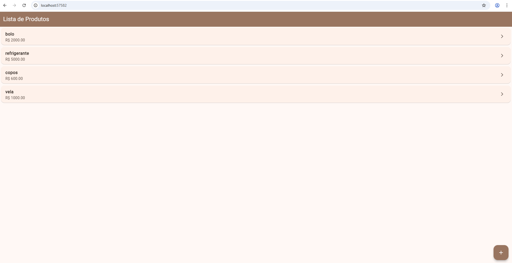
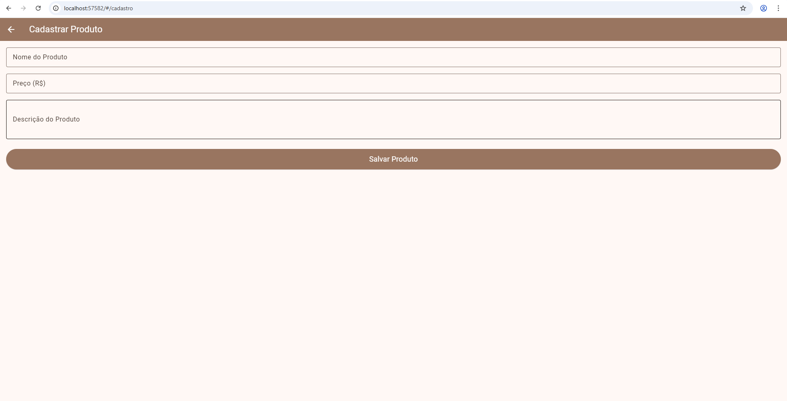
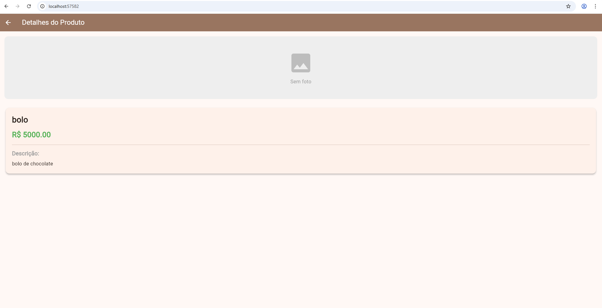

# App de Cadastro de Produtos

**Nome:** Luciana Rodrigues de Lara
**Turma:** 5ª Fase - Análise e Desenvolvimento de Sistemas - Senac Joinville

## Descrição do Projeto
Este projeto é um aplicativo desenvolvido em Flutter para a disciplina de Desenvolvimento para Dispositivos Móveis. O objetivo principal é demonstrar o uso de navegação entre múltiplas telas e a passagem de dados no aplicativo.

## Fluxo de Navegação
O aplicativo é composto por três telas principais que se comunicam:

1. **Lista de Produtos (Tela Inicial):** Exibe todos os produtos cadastrados. Possui um botão flutuante para adicionar novos produtos.
2. **Formulário de Cadastro:** Acessada ao clicar no botão de adicionar. Permite inserir o nome e o preço de um produto. Ao salvar, os dados são retornados para a tela inicial e adicionados à lista.
3. **Detalhes do Produto:** Acessada ao clicar em um item específico na lista. Recebe os dados do produto selecionado e exibe suas informações detalhadas na tela.

## Como Executar

Para rodar este projeto na sua máquina, siga os passos abaixo:

1. Certifique-se de ter o Flutter instalado e configurado corretamente.
2. Clone este repositório ou baixe o código.
3. Abra o terminal na pasta raiz do projeto.
4. Baixe as dependências executando o comando:
   flutter pub get
5. Execute o aplicativo com o comando:
   flutter run

## Capturas de Tela 

- Imagem 1: Tela de Lista de Produtos

- Imagem 2: Tela de Cadastro

- Imagem 3: Tela de Detalhes
